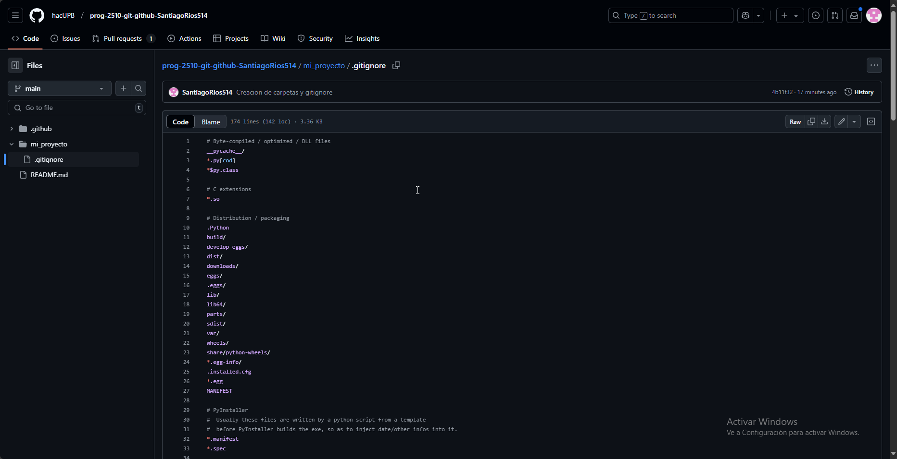

[](https://classroom.github.com/a/3WK28ho-)

# Bitácora

Nombre del studiante: Santiago Ríos Duque

Id.: 000557626

## Descripción del proyecto

Este proyecto se basa en recopilar información sobre el uso de las herramientas Git y Github, con el fin de completar un repositorio con un código ejemplo y los archivos necesarios para que este pueda ser ejecutado. El proyecto se fija principalmente en asegurarse que se tienen claros los comandos de la consola para usarla, crear repositorios locales y sincronizarlos con repositorios remotos. Para esto, se escribieron tres documentos listados más abajo, que tienen una guía clara sobre los comandos y pasos necesarios para hacer esto.

## Pasos para clonar y ejecutar el proyecto

Para clonar y ejecutar este proyecto, debes ir a la terminal de git y moverte al directorio donde quieres que se clone el proyecto. Seguido de esto, hay que ejecutar el siguiente comando para clonar el proyecto al directorio local:

```bash
git clone https://github.com/hacUPB/prog-2510-git-github-SantiagoRios514.git
```

Ahora encontrarás todas las carpetas pertenecientes al proyecto en el directorio local que escogiste. 

Para ejecutar el código del proyecto, debes ubicar el archivo `script.py`, este se encuentra en el directorio `src/`: [script.py](src/script.py)

Para ejecutarlo, tienes que asegurarte de que tengas `Python` instalado, puedes instalarlo desde la Tienda de Windows.

Ahora, navega a la ubicación donde clonaste el directorio y luego, al directorio `src/`. La ubicación debe ser algo así:

```
C:\Users\user\Documents\Programacion_2025_Repo\prog-2510-git-github-SantiagoRios514
```

Ahora, escribe el siguiente comando, que te permitirá ejecutar el archivo `script.py`

```
python3 script.py
```

Si aparece lo siguiente en la consola de comandos, lo hiciste todo correctamente y puedes usar la herramienta de este proyecto.

```
Bienvenido al programa de cálculo de promedios.
Ingresa números uno por uno. Escribe 'salir' para terminar.
Ingresa un número (o escribe 'salir'):
```

## Tabla de Contenido del proyecto

- [docs/](docs/)
  - [uso_consola.md](docs/uso_consola.md)
  - [repositorio_local.md](docs/repositorio_local.md)
  - [repositorio_remoto.md](docs/repositorio_remoto.md)
- [images/](images/)



- [src/](src/)
  - [script.py](src/script.py)
- [.gitignore](.gitignore)
- [README.md](README.md)
