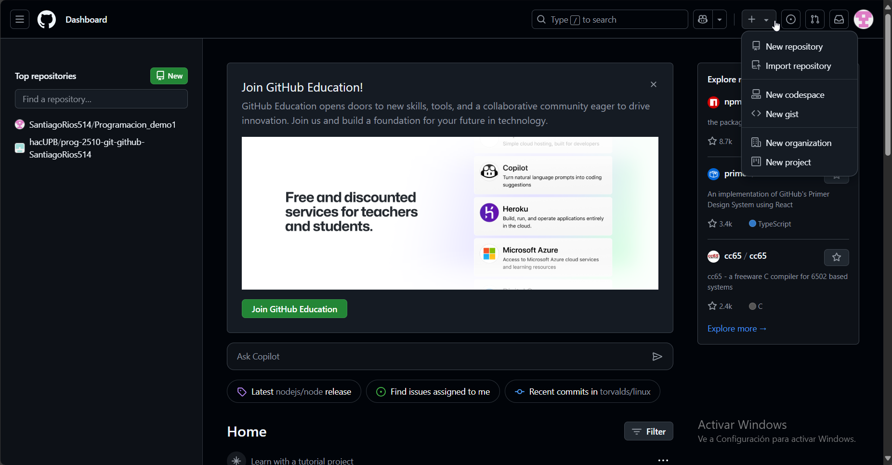

# Cómo sincronizar tu repositorio local con el repositorio remoto en Github

## Para crear y sincronizar un repositorio remoto en Github, debes de seguir los siguientes pasos

### 1. Crear una cuenta y un repositorio nuevo en Github

Para crear una cuenta en Github, hay que ingresar a la página web de [Github](https://www.github.com). Seguido se debe crear una cuenta o ingresar a tu cuenta si ya tienes una.

Después, en la página principal le debes dar click al botón con el signo `+`, lo que mostrará una opción llamada `New repository`. Allí, hay que crear un repositorio con las opciones que se requieran para el proyecto. Puedes elegir su nombre, su lenguaje, así como si es público o privado.



## 2. Vincular el repositorio con un directorio local

Para vincular el repositorio, primero hay que escoger un directorio con el cuál el repositorio remoto se vinculará. Hay que crear o entrar a un directorio utilizando los comandos de la consola. Se debe entrar a este directorio para seguir los siguientes pasos.

Ahora cuando entres a la página del repositorio, aparecerá un link de github que identifica ese repositorio. Hay que copiarlo y escribir el siguiente comando en la consola de Git Bash.

```bash
git remote add origin https://github.com/usuario/ejemplo.git
```

Este repositorio ya estará vinculado con el directorio escogido en el computador local.

## 3. Actualizar archivos y hacer commits

Ahora, se siguen los mismos pasos del repositorio local para crear, editar y actualizar archivos o directorios. Cuando se quiera guardar un archivo se debe hacer el mismo proceso de agregarlos con `git add` y realizar commits con `git commit -m "Mensaje"`.

## 4. Sincronizar commits locales con el repositorio remoto

Cuando se hagan los commits que fueran necesarios y se quiera sincronizar remotamente, hay que hacer lo que se llama un `push`. Este comando sincroniza el repositorio local con el repositorio remoto, para usarlo, se debe escribir lo siguiente en la línea de comando

```bash
git push origin main
```

Finalmente, para estar seguros de que ambos repositorios estén apuntando al mismo commit se debe verificar el estado y el historial con los comandos `git status` y `git log`.

Cuando se use el comando `git status`, debería aparecer un mensaje parecido a: `Your branch is up to date with 'upstream/master'.`

Cuando se use el comando `git log`, debería aparecer un mensaje parecido a: `(HEAD -> master, upstream/master)`

Así, se puede asegurar que los commits locales están sincronizados con los commmits remotos y toda la configuración fue correcta para generar la sincronización con Github.
